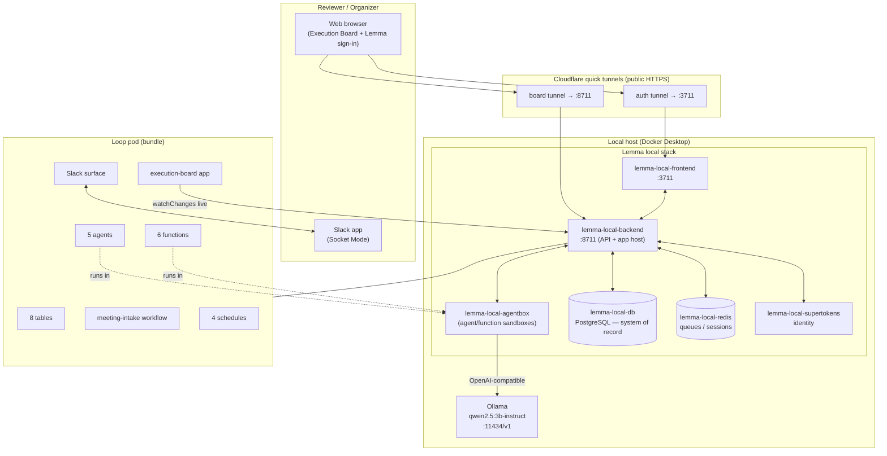
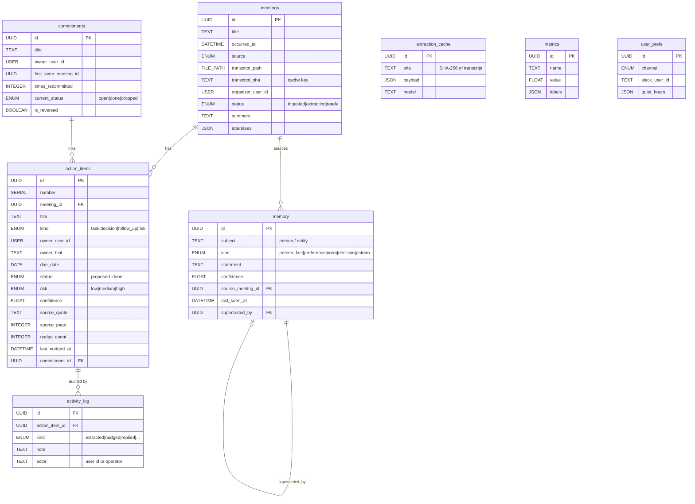
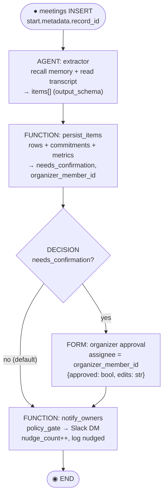
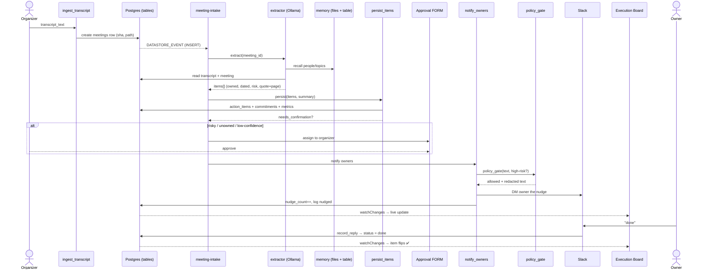
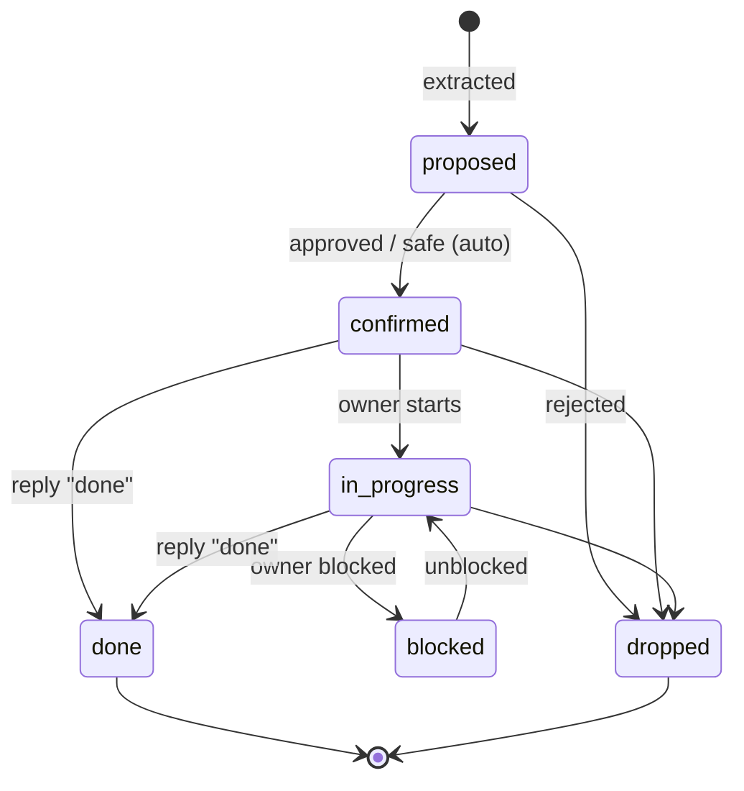
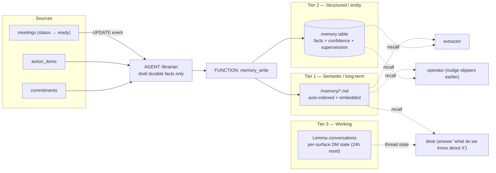

# Loop — System Architecture & Workflow

**Loop is the operator that owns meeting follow-through.** A transcript goes in; owned, dated,
risk-scored action items come out — owners are nudged on Slack, risky items are gated behind a human
approval, overdue work is chased autonomously, and commitments + context are **remembered across
meetings**. It is *not* a note-taker; it is the operator that makes sure what was decided actually
happens.

This document is the reference architecture for the submission: it maps every moving part and the
UML diagrams that describe them (component/deployment, entity-relationship, workflow activity,
end-to-end sequence, state machine, and the memory data-flow).

- **Platform:** [Lemma](https://github.com/lemma-work/lemma-platform) local stack (Docker).
- **Agent runtime:** local **Ollama** open model `qwen2.5:3b-instruct` (tools-capable), reached from
  the agent sandbox at `host.docker.internal:11434/v1` via an OpenAI-compatible runtime profile —
  zero API cost, nothing leaves the machine. Hosted GPT-5.5 is a drop-in alternative.
- **One substrate:** Postgres-backed tables, files-as-RAG, one rich agent, functions for multi-write,
  a workflow with a real human FORM, event + cron schedules, a Slack surface, and a live
  `watchChanges` app. No external vector DB, no second database.

---

## 1. Deployment / Component diagram

How the running system is wired — from the reviewer's browser, through the public Cloudflare tunnels,
into the Dockerized Lemma stack, out to the local model and Slack.

---

## 2. Entity-relationship diagram (Postgres tables)

Every Lemma table is a typed Postgres table with row-level security. `id / created_at / updated_at /
user_id` are system columns (auto). Only `user_prefs` has RLS enabled (per-user); the rest are shared
pod state.

---

## 3. Meeting-intake workflow (activity diagram)

The choreography that runs on every new `meetings` row. `DATASTORE_EVENT` exposes the changed row id
at `start.metadata.record_id`. The **DECISION** gate routes uncertain/risky/unowned batches to a real
human **FORM**; everything else flows straight to notification.

`needs_confirmation` is set true by `persist_items` when any item is low-confidence (< 0.6), unowned,
or high-risk — so imperfect extraction is caught by a human instead of silently acted on.

---

## 4. End-to-end sequence diagram (the hero flow)

From dropping a transcript to a live board update and a Slack reply — including memory recall and the
approval gate.

A parallel path keeps work honest without a meeting: the **daily-chase** cron wakes the `operator`
(09:00 weekdays) to nudge/escalate due + overdue items, and Slack messages route to the `desk` agent
for Q&A ("what's due today", "what do we know about Priya", "mark #12 done").

---

## 5. Action-item lifecycle (state machine)

Extracted items start `proposed`; the approval FORM (or auto-confirm for safe items) promotes them to
`confirmed`, after which owners drive them to completion.

---

## 6. Three-tier memory data-flow

The pod *is* the RAG system. The `librarian` distils durable facts after each meeting; the writer
persists them to both a structured table and auto-indexed markdown; later meetings **recall** them.

---

## 7. Event & schedule map

| Schedule | Type | Trigger | Runs |
| --- | --- | --- | --- |
| `intake-on-meeting` | DATASTORE | `meetings` INSERT | `meeting-intake` workflow |
| `daily-chase` | TIME | cron `0 9 * * 1-5` | `operator` agent (nudge / escalate) |
| `reconcile-on-item` | DATASTORE | `action_items` INSERT | `reconciler` agent (contradiction / recommitment) |
| `curate-memory` | DATASTORE | `meetings` UPDATE | `librarian` agent (grow memory) |

---

## 8. Components at a glance

| Layer | Resources |
| --- | --- |
| **Tables (8)** | `meetings`, `action_items`, `commitments`, `activity_log`, `memory`, `metrics`, `extraction_cache`, `user_prefs` (RLS) |
| **Functions (6)** | `ingest_transcript`, `persist_items`, `policy_gate`, `notify_owners`, `record_reply`, `memory_write` |
| **Agents (5)** | `extractor` (one rich judgment pass), `operator` (chaser), `reconciler`, `librarian` (memory curator), `desk` (Slack Q&A) |
| **Workflow (1)** | `meeting-intake` (extract → persist → gate → confirm/notify → end) |
| **Schedules (4)** | `intake-on-meeting`, `daily-chase`, `reconcile-on-item`, `curate-memory` |
| **Surface** | `slack` (Socket Mode, default agent `desk`) |
| **Files (3 folders)** | `/transcripts` (provenance), `/knowledge` (team-context), `/memory` (semantic) |
| **App** | `execution-board` (single-file HTML, live `watchChanges`) |

---

## 9. Guardrails, caching & observability

- **Guardrails:** `output_schema` forces typed, routable extractor output; **zero-default name-based
  grants** (each workload touches only its named resources); `policy_gate` runs **Presidio** PII
  redaction on anything leaving the pod and **blocks external high-risk sends unless
  `status=confirmed`**; the approval **FORM** is the human checkpoint; the operator uses
  `request_approval` before escalating.
- **Caching:** `extraction_cache` keyed by **SHA-256 of the transcript** — re-ingesting the same
  transcript returns stored extractor JSON instead of re-calling the model.
- **Observability:** `structlog` JSON logs in every function (`lemma-stack logs`), a `metrics` table
  (counts, nudges, `memory_facts_written`), an `activity_log` audit trail, the app's **Ops panel**,
  and `lemma workflows runs` history.

---

## 10. Access & live link

- **Live Product Link (submission):** public Cloudflare quick tunnel to the local Execution Board
  (ephemeral — regenerated with `scripts/host-live.ps1`). See the repo `README.md` for the current URL.
- **App demo login (role gate):** `admin@loop.demo` / `loop-admin` (can approve/reject) ·
  `user@loop.demo` / `loop-user` (read-only approvals). This app-level gate governs elevated actions;
  the Lemma platform (SuperTokens) remains the real identity/data-access boundary.
- **Demo video:** [`loop-demo.mp4`](loop-demo.mp4) — the full workflow walkthrough.
